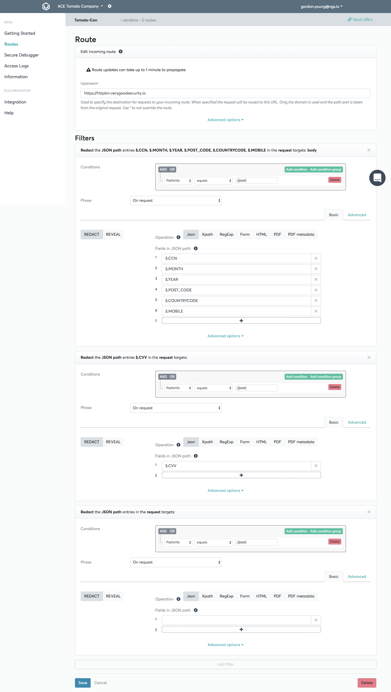
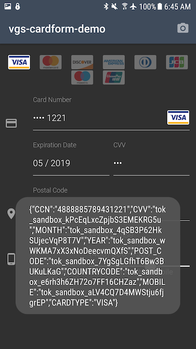

# VGS Android "add new payment card" Demo

This is an **"add payment card form"** for Android

- This demo shows a simple solution to securely add payment cards to an Android add, within your own code.   
- It is very simple to achieve PCI DSS v3.2 compliance with the VGS Secure Proxy and Vault components.   
- Code changes are minimal. Just set VGS as a "proxy" to your mobile backend.  

A simple method of protecting card data 

**Relevant Code:**   
- first marshall the payment card object into a JSON a structure : 

```java
JSONObject card = new JSONObject();
            try {
                card.put("CCN", mCardForm.getCardNumber());
                card.put("CVV", mCardForm.getCvv());
                card.put("MONTH", mCardForm.getExpirationMonth());
                card.put("YEAR", mCardForm.getExpirationYear());
                card.put("POST_CODE", mCardForm.getPostalCode());
                card.put("COUNTRYCODE", mCardForm.getCountryCode());
                card.put("MOBILE", mCardForm.getMobileNumber());

            } catch (JSONException e) {
                Log.e(this.getClass().getName(),e.getLocalizedMessage());;
            }
```

- Instantiate the MobileBackEndClient(URL vgs_proxy_url, String your_mbe_api_endpoint) with the VGS Proxy URL and desired endpoint.    

- Persist the sensitive data in the VGS Vault & get a result at the UI Callback.  


```java

            // Mobile Backend Service with VGS Proxy re-write rule: MobileBackEndClient(url, mbe_endpoint)
            MobileBackEndClient api = new MobileBackEndClient(url, mbe_endpoint); //URL reflects VGS proxy
            api.persistSensitive(card.toString(), new MobileBE_UICallback() {
                @Override
                public void onSuccess(String token) {
                    Toast.makeText(mCardForm.getContext(), token, Toast.LENGTH_SHORT).show();

                }

                @Override
                public void onFailure(MobileBE_Error error) {
                    Toast.makeText(mCardForm.getContext(), error.toString(), Toast.LENGTH_LONG).show();

                }
            });
```

- A secure "surrogate" or "token" value is persisted within your mobile backend service.   
- The original Card data is now protected within the VGS Vault for later use. 
- Use the secure "surrogate" or "token" to securely operate on sensistive data without handling it directly.
- Securely authorize payments without directly handling raw/plaintext payment card data in your mobile backend. 
- Safely & securely enrich other business processes, secure data analytics, etc.

**Example form:**    
    

**Example VGS Dashboard 'Route' configuration for this demo:**    
     

**Persist a new card results:**     
        

## How to run the demo:
**Installation requirements:**    
* Compile SDK Version: `API 27: Android 8.1 (Oreo)`    
* Min SDK Version:* `API 24: Android 7.0 (Nougat)`    

**Gradle Dependancies:**
```gradle
dependencies {
    implementation fileTree(include: ['*.jar'], dir: 'libs')
    testImplementation 'junit:junit:4.12'
    androidTestImplementation 'com.android.support.test.espresso:espresso-core:3.0.2'
    implementation 'com.braintreepayments:card-form:3.3.0'
    implementation 'io.card:android-sdk:5.5.1'
}
```

### Learn more at:    
https://www.verygoodsecurity.com    
https://www.verygoodsecurity.com/docs/overview

```
2018
gjyoung1974@gmail.com
```

